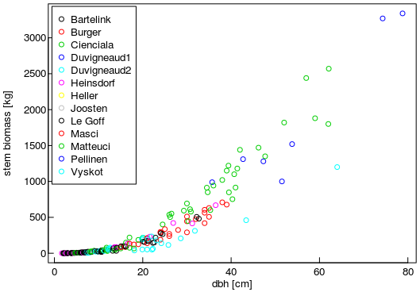
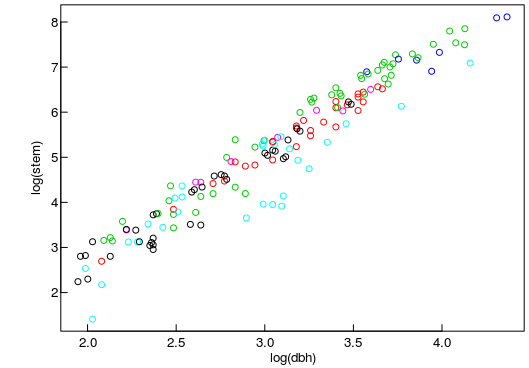
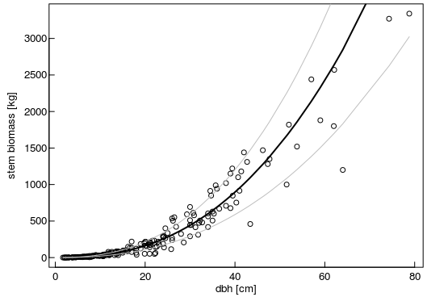
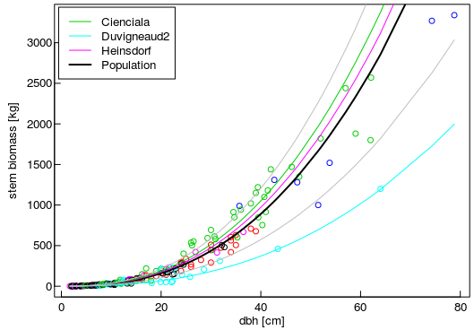

An Introduction to **twNlme** package
-------------------------------------

The **twNlme** is an extension of the **nlme** package that

-   unifies the usage of gnls and nlme
-   helps with calculating prediction uncertainty including that of
    fixed and random effects

Tree biomass example
--------------------

### The Data and the allometric model

Diameter `dbh` (cm) and stem biomass (kg) of trees of in the dataset
`Wutzler08BeechStem` have been reported by different authors.

We have to deal with heteroscedastic errors. The variance increases with
diameter and stem biomass.

Furthermore, trees have been measured at different locations and with
slightly different methods. Hence, there are groupings in the data, and
the records of one study are not independent of each other.

    require(twNlme, quietly = TRUE)

    head(Wutzler08BeechStem)

    ##      author stand alt si age  stockden  dbh height  stem
    ## 1 Bartelink    28  23 36  20 1.4140742  8.4   9.80 16.50
    ## 2 Bartelink    28  23 36  20 1.8189853  9.9  11.25 22.80
    ## 3 Bartelink    28  23 36  20 2.4107784 10.7   9.70 24.70
    ## 4 Bartelink    29  23 36  21 1.6676217 10.6   9.75 22.40
    ## 5 Bartelink    29  23 36  21 1.7049168 10.7   9.30 21.30
    ## 6 Bartelink    29  23 36  21 0.6020487  7.0   8.40  9.41

    ds <- Wutzler08BeechStem[order(Wutzler08BeechStem$dbh),]
    plot( stem~dbh, col = author, data = ds, xlab = "dbh [cm]", ylab = "")
    mtext( "stem biomass [kg]", 2, 2.8, las = 0)
    legend( "topleft", inset = c(0.01,0.01), levels(ds$author), col = 1:13, pch = 1 )

The objective is to estimate stem biomass based on measured tree
diameters.

The functional relationship can be described by an allometric equation:
*y* = *β*0*d**β*1. Where *y* is the
stem biomass, *d* is the diameter, and *β**i* are estimated
model coefficients.

A log-transformation yields a linear form. And the plot reveals a
similar slope between authors but differences in the intercept:
*l**o**g*(*y*)=*l**o**g*(*β*0)+*β*1*l**o**g*(*d*).

    plot( log(stem)~log(dbh), col = author, data = subset(ds, dbh >= 7) )

### Ignore the grouping structure

First, the data is fitted with ignoring the grouping stucture, which
leads to a severe underestimation of uncertainty of aggregated stem
biomass predictions.

    lm1 <- lm( log(stem)~log(dbh), data = ds )
    .start <- structure( c( exp(coef(lm1)[1]), coef(lm1)[2] ), names = c("b0","b1")) 

    gm1 <- gnls( stem ~ b0 * dbh^b1 
        , data = ds 
        , params = c(b0+b1~1)
        , start = .start   
        , weights = varPower(form = ~fitted(.))
    )
    gm1

    ## Generalized nonlinear least squares fit
    ##   Model: stem ~ b0 * dbh^b1 
    ##   Data: ds 
    ##   Log-likelihood: -886.4868
    ## 
    ## Coefficients:
    ##       b0       b1 
    ## 0.103384 2.458062 
    ## 
    ## Variance function:
    ##  Structure: Power of variance covariate
    ##  Formula: ~fitted(.) 
    ##  Parameter estimates:
    ##    power 
    ## 1.031154 
    ## Degrees of freedom: 187 total; 185 residual
    ## Residual standard error: 0.2757708

    plot( stem~dbh, data = ds, xlab = "dbh [cm]", ylab = "")
    mtext( "stem biomass [kg]", 2, 2.5, las = 0)
    lines( fitted(gm1) ~ dbh, data = ds, col = "black", lwd = 2 )

    sdEps <- sqrt( varResidPower(gm1, pred = fitted(gm1)) )
    gm1a <- attachVarPrep(gm1, fVarResidual = varResidPower)
    sd <- varPredictNlmeGnls(gm1a, newdata = ds)[,"sdInd"] 
    lines( fitted(gm1)+sd ~ dbh, data = ds, col = "grey" )
    lines( fitted(gm1)-sd ~ dbh, data = ds, col = "grey" )

Note, the usage of function `varResidPower` to calculate uncertainty of
the residuals that depends on the fitted values.

In addition to residual variance `varResid`, there is prediction
uncertainty due to uncertainty in model coefficients: `varFix`. This
component is, however, 3 orders of magnitudes smaller. Hence, the
prediction uncertainty of the population `sdPop` is much smaller than
the prediction uncertainty of an individual `sdInd`.

    apply( varPredictNlmeGnls(gm1a, newdata = ds), 2, median )

    ##         fit      varFix      varRan    varResid       sdPop       sdInd 
    ##  125.890054    9.202466    0.000000 1629.016028    3.033557   40.474912

Note, the usage of function `varPredictNlmeGnls` to calculate variance
due to uncertainty in model coefficients. It makes use of a Taylor
approximation and needs to evaluate the derivatives of the statistical
model at the predictor values. These derivative functions are
symbolically derived before by calling function `attachVarPrep`.

Now, we use the model to calculate stem biomass and its uncertainty for
n=1000 trees with a diameter of about 30cm.

    n <- 1000      # sum over n trees
    set.seed(0815)
    dsNew <- data.frame(dbh = rnorm(n, mean = 30, sd = 2), author = ds$author[1])
    yNew <- predict(gm1a, newdata = dsNew )
    varNew <- varPredictNlmeGnls(gm1a, newdata = dsNew)
    # on average each tree biomass with 33% uncertainty
    median( varNew[,"sdInd"]/yNew ) 

    ## [1] 0.3349375

    yAgg <- sum(yNew)
    # completly independent:
    cvYAggRes <- sqrt( sum(varNew[,"varResid"]) ) / yAgg    # only 1% uncertainty ?
    # indpendent but account for uncertainty in model coefficients
    varSumComp <- varSumPredictNlmeGnls(gm1a, newdata = dsNew, retComponents = TRUE)
    cvYAggInd <- varSumComp["sdPred"]/yAgg       # 3.1%
    # dependent errors: add standard deviation
    # 33%: no decrease with increasing n
    cvYAggDep <- sum( sqrt(varNew[,"varResid"]) ) / yAgg   
    structure( c( cvYAggRes, cvYAggInd, cvYAggDep )*100
               , names = c("Residuals","Independent","Correlated"))

    ##   Residuals Independent  Correlated 
    ##    1.069402    3.302089   33.368678

    varSumComp/(n*10)

    ##         pred       sdPred       varFix       varRan     varResid 
    ##    44.849294     1.480964 19632.189800     0.000000  2300.348169

With aggregating over n=1000 trees, the residual uncertainty `varResid`
declines and the uncertainty of model coefficients `varFix` becomes more
important. Accounting for model coefficients raises the coefficient of
variation from 1% to 3%.

However, we cannot treat the predictions as independent of each other.
To be conservative we assumme that errors add up and report a cv of 33%.

Note, how the aggregated uncertainty of model coefficients has been
calculated by function `varSumPredictNlmeGnls`. The calculation involves
the evaluation of the derivative functions for each compination of
predictors. Hence, it scales with *O*(*n*2) and takes some
time for large n.

### Accounting for the grouping with mixed models

Now we refit the model using random effects in coefficient
*β*0. I.e. we assume that it can vary between authors around
a common central value. Additionally, we assume that increase in
residual variance with stem biomass can differ between authors.

*y* = (*β*0 + *b*0, *k*)*d**β*1 + *ϵ*

*b*0, *k* ∼  𝒩(0,  *σ**k*2)

    mm1 <- nlme( stem ~ b0 * dbh^b1 
            , data = ds 
            , fixed = c(b0+b1~1)
            , random = list(author = c(b0 ~1))
            #, random = list(author = c(b1 ~1))
            #, random = list(author = c(b0+b1 ~1))
            , start = .start   
            , weights = varPower(form = ~fitted(.)|author)
    )
    mm1

    ## Nonlinear mixed-effects model fit by maximum likelihood
    ##   Model: stem ~ b0 * dbh^b1 
    ##   Data: ds 
    ##   Log-likelihood: -828.8601
    ##   Fixed: c(b0 + b1 ~ 1) 
    ##         b0         b1 
    ## 0.09491307 2.47957395 
    ## 
    ## Random effects:
    ##  Formula: b0 ~ 1 | author
    ##                 b0  Residual
    ## StdDev: 0.02341744 0.1942184
    ## 
    ## Variance function:
    ##  Structure: Power of variance covariate, different strata
    ##  Formula: ~fitted(.) | author 
    ##  Parameter estimates:
    ##   Bartelink   Cienciala Duvigneaud1 Duvigneaud2   Heinsdorf     Le Goff 
    ##   1.0442361   1.0204557   1.0669883   1.1414447   1.0112554   0.8948631 
    ##       Masci    Matteuci      Vyskot 
    ##   0.9773092   1.0839169   1.0421887 
    ## Number of Observations: 187
    ## Number of Groups: 9

    plot( stem~dbh, col = author, data = ds, xlab = "dbh [cm]", ylab = "")
    mtext( "stem biomass [kg]", 2, 2.5, las = 0)
    yds <- predict(mm1, level = 0) 
    lines( yds ~ dbh, data = ds, col = "black", lwd = 2)

    #authors <- levels(ds$author)
    authors <- c("Heinsdorf","Cienciala","Duvigneaud2")
    for (authorI in authors) {
        dsNa <- ds; dsNa$author[] <- authorI
        try(lines( predict(
          mm1, level = 1, newdata = dsNa) ~ dbh, data = dsNa
          , col = which(authorI == levels(ds$author)) ))
    }
    legend( 
      "topleft", inset = c(0.01,0.01), legend = c(sort(authors),"Population")
      , col = c(which(levels(ds$author) %in% authors),"black")
      , lty = 1, lwd = c(rep(1,length(authors)),2) )

    #sd <- sqrt( varResidPower(gm1, pred = predict(mm1, level = 0)) )
    # calculate symbolic derivatives used in variance prediction
    mm1a <- attachVarPrep( mm1, fVarResidual = varResidPower)     
    sd <- varPredictNlmeGnls(mm1a, newdata = ds)[,"sdInd"]# variance components
    lines( yds+sd ~ dbh, data = ds, col = "grey" )
    lines( yds-sd ~ dbh, data = ds, col = "grey" )

The uncertainty of a single prediction did not change. However, the
variance across the populations by the authors `varRan` is now about as
large as the residual variance `varResid`:

    apply( varPredictNlmeGnls(mm1a, newdata = ds), 2, median )

    ##       fit    varFix    varRan  varResid     sdPop     sdInd 
    ## 122.98921 108.49314 920.79088 771.94335  32.08246  42.44087

This is significant, for the error propagation, because the uncertainty
in model coefficients does not decrease with the number of measured
trees.

    yNew <- predict(mm1, newdata = dsNew, level = 0 )
    yAgg <- sum(yNew)
    (varSumCompM <- varSumPredictNlmeGnls(mm1a, newdata = dsNew, retComponents = TRUE))

    ##         pred       sdPred       varFix       varRan     varResid 
    ## 4.431073e+05 1.158402e+05 1.455665e+09 1.195212e+10 1.116884e+07

    (cvAgg <- varSumCompM["sdPred"] / yAgg )     # 26% uncertainty

    ##    sdPred 
    ## 0.2614269

When accounting for the groups, the uncertainty for the prediction of
1000 trees of an unknown group of 26% is much higher than the
uncertainty of 3.3% estimated by ignoring the groups.

### Alternative: bootstrap aggregated uncertainty

An alternative way of calculating the uncertainty of the aggregated
value, the sum of biomass of n trees, is to apply a bootstrap. For
`nBoot` times random realizations are drawn for fixed effects and for
the random effects.

For each sample, the tree biomass and its sum is calculated. At the end,
we obtain a distribution of the aggregated value and can obtain an
uncertainty estimate from it.

This way requires a bit more programming, specific to the used model,
but is faster for large `n`. It confirmes our previous uncertainty
estimate of 26%.

Note the usage of functions `varFixef` and `varRanef`, that extract the
covariance matrix of fixed and random effects from the model object.

    require(mnormt)     # multivariate normal
    nBoot <- 400

    # random realizations of fixed effects
    beta <- rmnorm(nBoot, fixef(mm1), varFixef(mm1) )       
    # random realizations of b0
    b0 <- rnorm(nBoot, 0 , sqrt(varRanef(mm1)) )            
     # extract the coefficients of heteroscedastic variance model 
    sigma0 <- mm1$sigma                                      
    delta <- mean( coef(mm1$modelStruct$varStruct,uncons = FALSE, allCoef = TRUE)
                   , nBoot, replace = TRUE)
     # do the bootstrap
    res <- sapply( 1:nBoot, function(i) {
                yNewP <- (beta[i,"b0"] + b0[i]) * dsNew$dbh^(beta[i,"b1"])
                sigma <- sigma0 * yNewP^delta
                # random realizations of resiudal base
                eps <- rnorm( nrow(dsNew), 0, sigma)    
                yNewT <- yNewP + eps
                yAggi <- sum(yNewT)
            })
    sd(res)/yAgg        # confirms cv = 26%

    ## [1] 0.2592882
